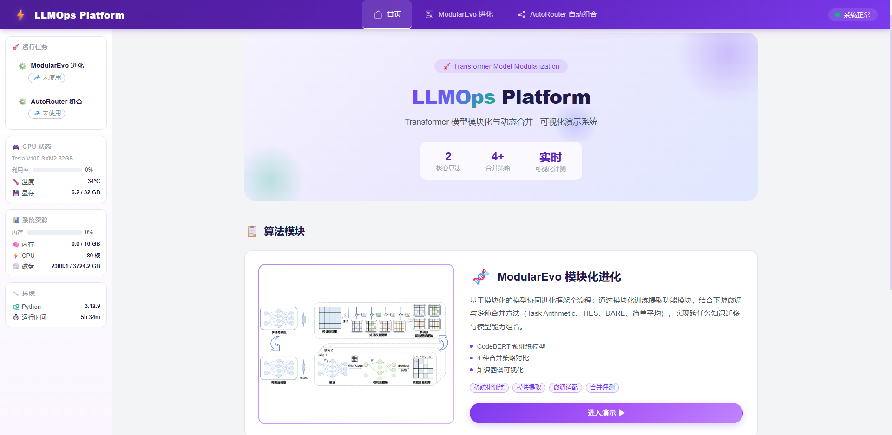
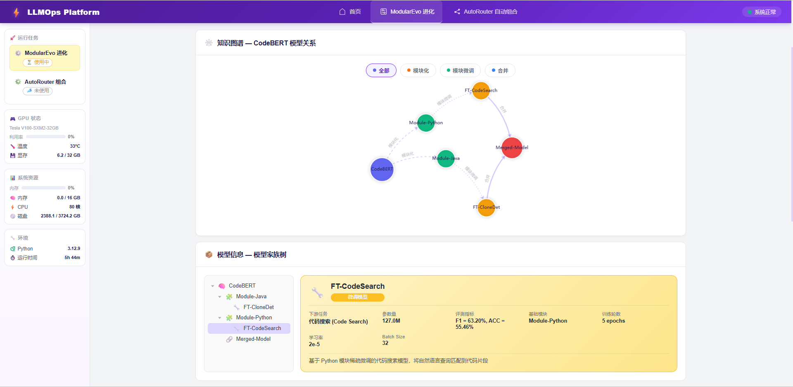
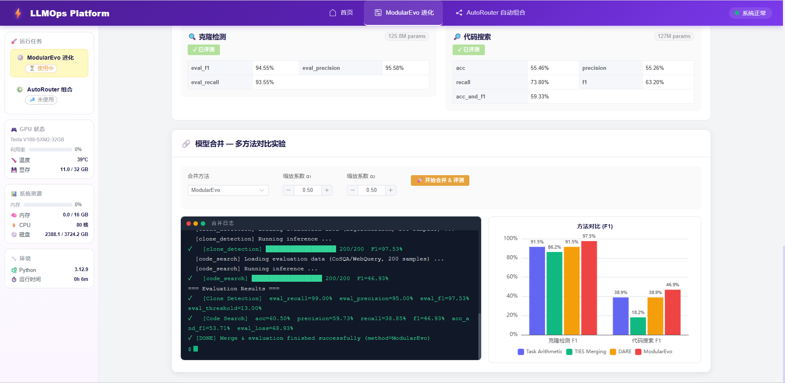
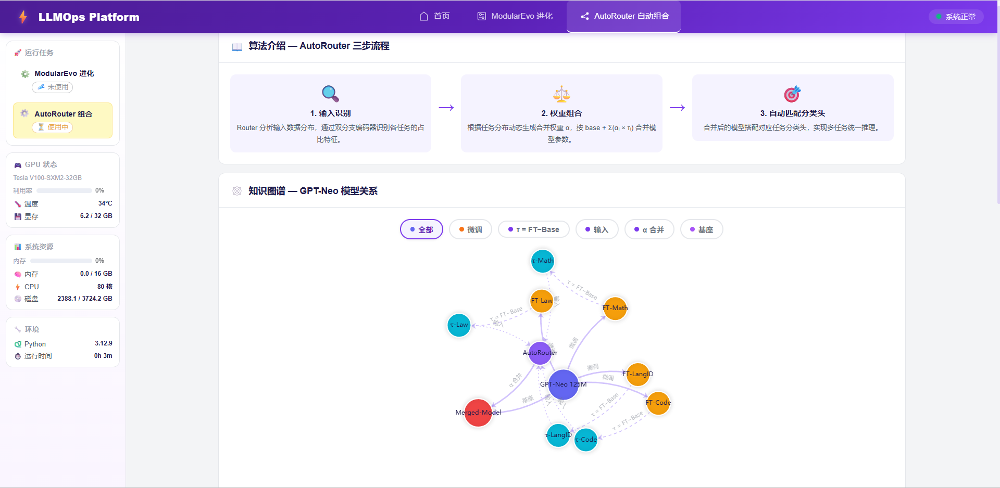
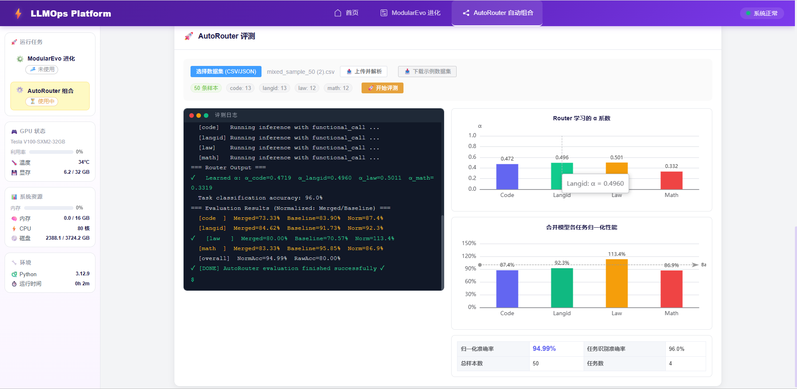

# ModularEvo-Platform

[](https://opensource.org/licenses/MIT)
[](https://www.python.org/downloads/)
[](https://pytorch.org/)
[](https://vuejs.org/)
[](https://fastapi.tiangolo.com/)

**ModularEvo-Platform** 是一个基于神经网络模块化思想的 **AI 模型协同演化原型系统**。本系统旨在解决深度学习模型在多任务持续演化中面临的「权重冲突」、「知识孤岛」以及「多任务混合场景下静态融合不灵活」等痛点，提供了从底层算法到上层可视化交互的完整工程落地实践。系统核心算法由我们设计，并发表了论文：[ModularEvo: Evolving Multi-Task Models via Neural Network Modularization and Composition](doc/ModularEvo.pdf)。

## 📝 引用
```bibtex
@inproceedings{long2026modularevo,
	title={ModularEvo: Evolving Multi-Task Models via Neural Network Modularization and Composition},
	author={Long, Wenrui and Qi, Binhang and Sun, Hailong and Yang, Zongzhen and others},
	booktitle={International Conference on Software Engineering (ICSE)},
	year={2026}
}
```

## 📸 系统截图

### 首页总览
> 实时展示 GPU/内存/CPU 系统资源，提供两大核心算法模块的入口导航。



### 基于模块化方法的AI模型协同演化框架（ModularEvo）

> 基于 CodeBERT 的知识图谱可视化、模型家族树、稀疏模块加载分析。




> 支持 Task Arithmetic、TIES、DARE、ModularEvo 四种合并策略对比，实时日志 + F1 柱状图。



### 面向AI模型协同演化的模型合并优化方法 (AutoRouter)
> 基于 GPT-Neo 125M 的自适应路由器，三步流程：输入识别 → 权重组合 → 自动匹配分类头。



> 上传混合任务数据集，一键评测，可视化 Router α 系数与归一化性能。



---

## 🏗️ 系统架构

本系统采用严格的分层解耦设计：
*   **前端展示层 (Frontend):** 基于 `Vue 3` + `Vite` + `Element Plus`，集成 `ECharts` 实现复杂的演化网络渲染。
*   **后端服务层 (Backend):** 基于 `FastAPI` + `Uvicorn`，提供高并发的异步 RESTful API，并使用 `SQLAlchemy` + `SQLite` 进行轻量级状态持久化。
*   **算法适配层 (Algorithm Adapter):** 对接论文中的核心算法，解耦 Web 服务与底层算力调度。
*   **数据与资源层 (Data & Resources):** 规范化管理预训练模型 (`HuggingFace Transformers`)、微调模块、动态路由权重及混合测试数据集。

## 🧠 核心算法

### Chapter 3 — ModularEvo 模块化模型合并

基于 **CodeBERT** 预训练模型，通过模块化训练提取功能模块，结合下游微调与多种合并方法实现跨任务知识迁移：

| 合并方法 | 说明 |
|---------|------|
| **Task Arithmetic** | 直接加权求和 Task Vectors |
| **TIES Merging** | 稀疏化处理，自动移除冲突参数 |
| **DARE** | 随机丢弃参数，并对剩余参数进行缩放 |
| **ModularEvo** | 稀疏微调 + Task Arithmetic |

- 下游任务：克隆检测 (Clone Detection)、代码搜索 (Code Search)
- 语言模块：Java / Python
- 评测指标：ACC

### Chapter 4 — AutoRouter 自适应路由

基于 **GPT-Neo 125M** 的动态路由合并框架：

1. **输入识别**：Router 分析输入数据分布，识别各任务占比特征
2. **权重组合**：根据任务分布动态生成合并权重 α，按 `base + Σ(αᵢ × τᵢ)` 合并模型参数
3. **自动匹配分类头**：合并后的模型搭配对应任务分类头，实现多任务统一推理

- 覆盖 4 类任务：Code（代码分类）、LangID（语言识别）、Law（法律分类）、Math（数学 QA）
- 支持用户上传自定义混合数据集进行评测

## 📂 项目结构

```
ModularEvo-Platform/
├── algorithm/                  # 核心算法层
│   ├── chapter3/               #   ModularEvo 模块化合并
│   │   ├── config.py           #     配置（模型路径、任务定义）
│   │   ├── evaluator.py        #     评测器
│   │   ├── merger.py           #     合并执行器
│   │   ├── model_loader.py     #     模型加载
│   │   └── libs/               #     底层工具（mask、merge、sparse 等）
│   └── chapter4/               #   AutoRouter 自适应路由
│       ├── config.py           #     配置（GPT-Neo、任务头）
│       ├── adapter.py          #     算法适配接口
│       └── libs/               #     底层工具（router、task_vectors 等）
├── backend/                    # 后端服务层 (FastAPI)
│   ├── main.py                 #   应用入口
│   ├── api/                    #   路由 & Schema
│   │   ├── chapter3.py         #     /api/ch3 路由
│   │   ├── chapter4.py         #     /api/ch4 路由
│   │   └── system.py           #     /api/system 系统监控
│   ├── core/config.py          #   全局配置
│   └── models/database.py      #   SQLite 数据持久化
├── frontend/                   # 前端展示层 (Vue 3)
│   ├── src/
│   │   ├── views/
│   │   │   ├── HomeView.vue        # 首页总览
│   │   │   ├── ModularEvoView.vue  # 模块化进化演示
│   │   │   └── AutoRouterView.vue  # 自适应路由演示
│   │   ├── components/             # 可复用组件
│   │   ├── api/                    # Axios 请求封装
│   │   └── router/                 # Vue Router 路由定义
│   └── vite.config.js
├── data/                       # 数据与模型资源（不纳入版本控制）
│   ├── datasets/               #   评测数据集
│   ├── models/                 #   预训练模型、微调模型、路由器权重
│   └── uploads/                #   用户上传文件
├── start.sh                    # 一键启动脚本
└── stop.sh                     # 一键停止脚本
```

## 🚀 快速开始

### 环境要求

- Python 3.8+
- Node.js 16+

### 安装 & 启动

```bash
# 1. 克隆项目
git clone https://github.com/Zachary941/ModularEvo-Platform.git
cd ModularEvo-Platform

# 2. 安装后端依赖
pip install fastapi uvicorn torch transformers sqlalchemy aiofiles

# 3. 安装前端依赖
cd frontend && npm install && cd ..

# 4. 一键启动（后端 :8000 + 前端 :3000）
bash start.sh

# 5. 停止服务
bash stop.sh
```

启动后访问 http://localhost:3000 进入系统。


## 🛠️ 技术栈

| 层级 | 技术 |
|------|------|
| **前端** | Vue 3 · Vite · Element Plus · ECharts · Axios |
| **后端** | FastAPI · Uvicorn · SQLAlchemy · SQLite |
| **算法** | PyTorch · HuggingFace Transformers |
